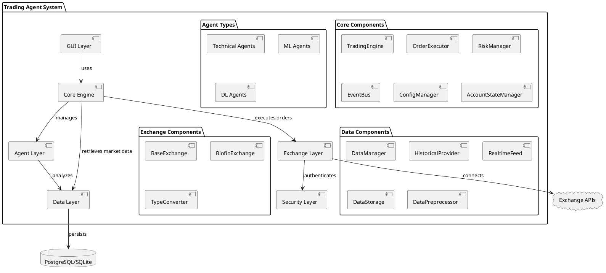
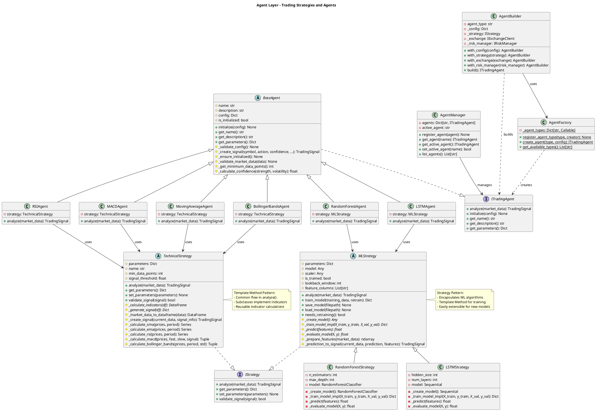
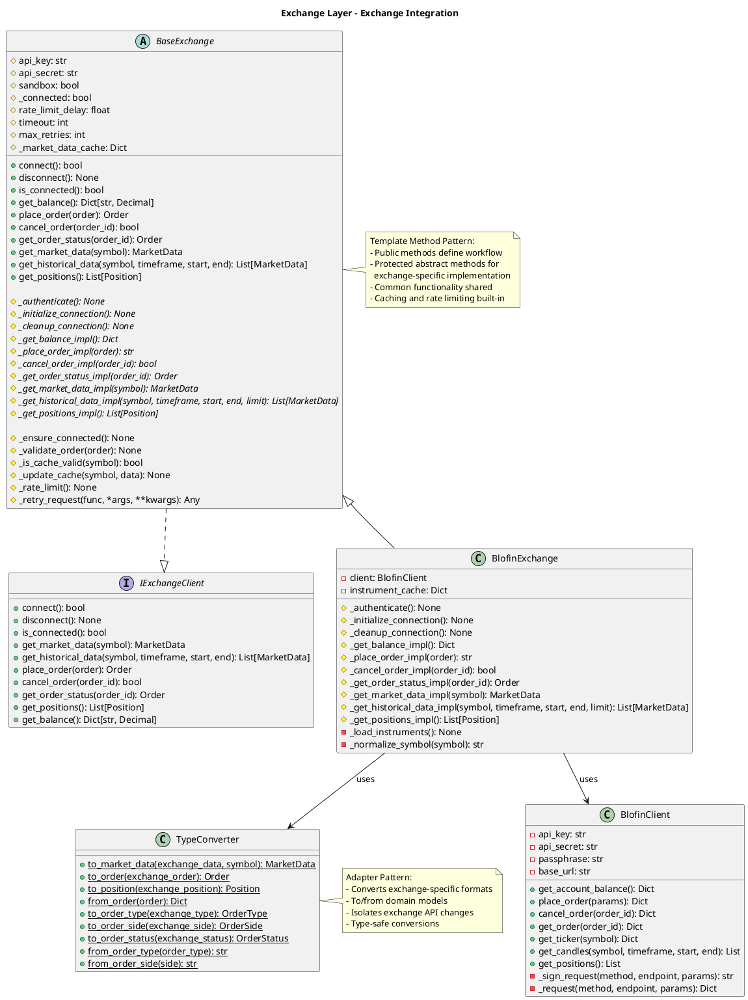
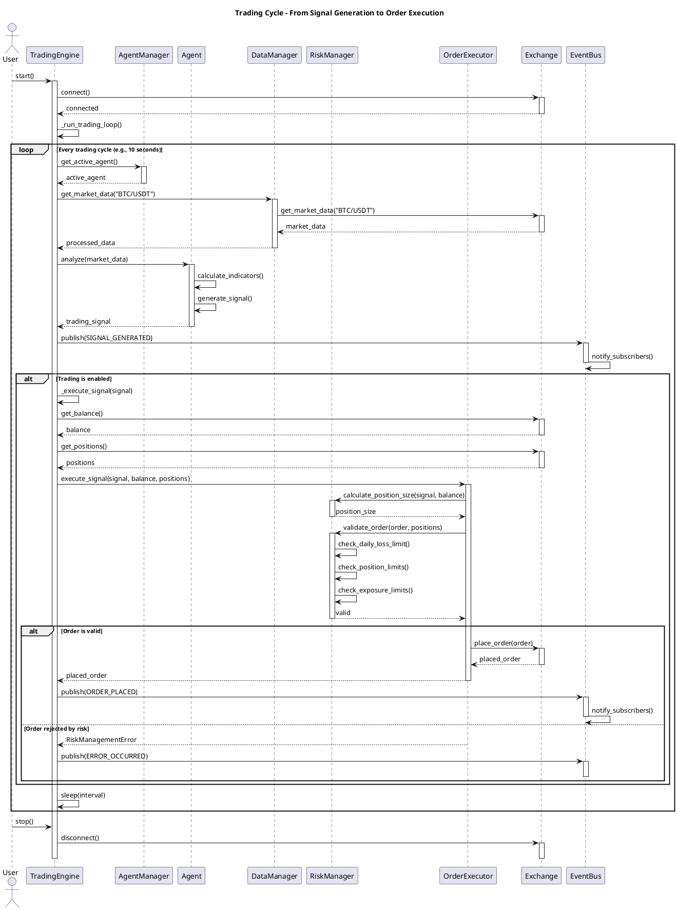
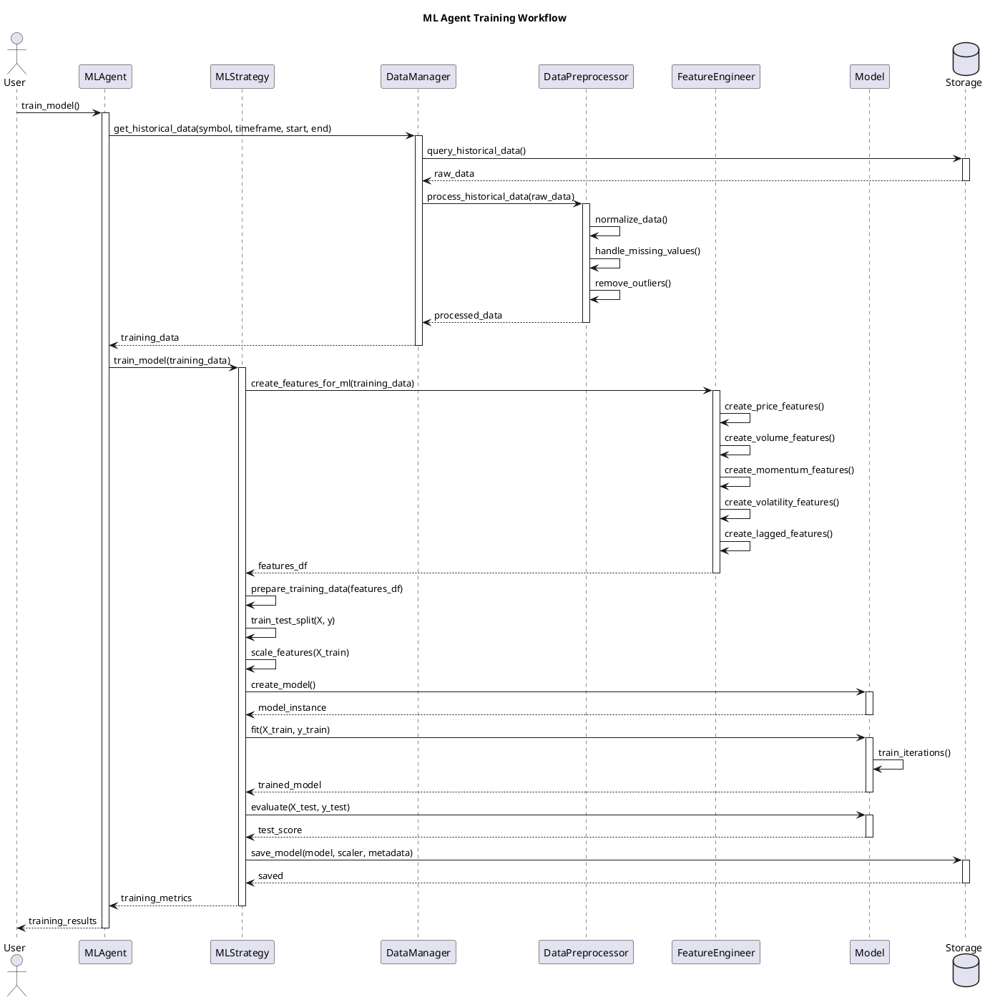
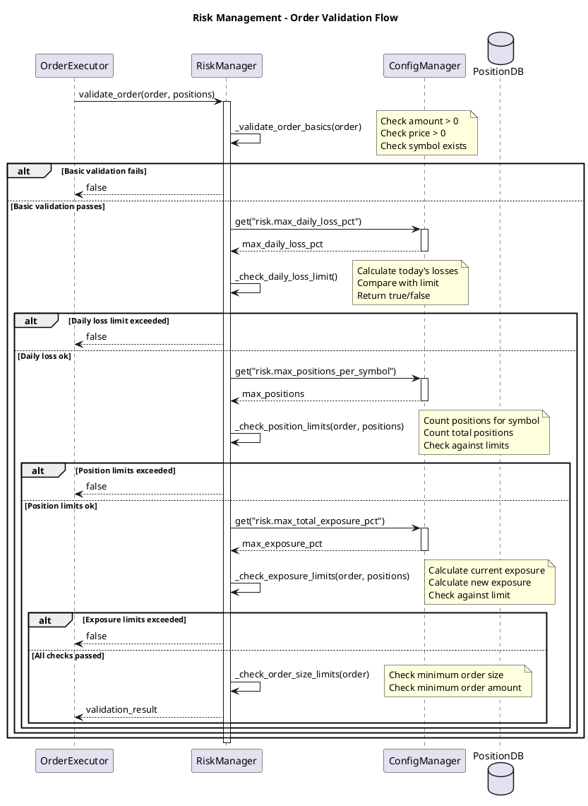

# Trading Agent System - Architecture Documentation
## UML Diagrams and System Design

**Project:** Crypto Trading Agent System
**Date:** 2025-12-18
**Architecture Style:** Layered Architecture with SOLID Principles

---

## Table of Contents
1. [System Overview](#system-overview)
2. [High-Level Component Diagram](#high-level-component-diagram)
3. [Core Layer Class Diagram](#core-layer-class-diagram)
4. [Agent Layer Class Diagram](#agent-layer-class-diagram)
5. [Exchange Layer Class Diagram](#exchange-layer-class-diagram)
6. [Data Layer Class Diagram](#data-layer-class-diagram)
7. [Sequence Diagrams](#sequence-diagrams)
8. [Design Patterns Applied](#design-patterns-applied)
9. [SOLID Principles Analysis](#solid-principles-analysis)

---

## System Overview

The Crypto Trading Agent System is a comprehensive platform for algorithmic cryptocurrency trading. It supports multiple trading strategies (technical analysis and machine learning), multiple exchanges, risk management, and both paper and live trading modes.

### Key Architectural Characteristics:
- **Layered Architecture**: Clear separation between Core, Agents, Exchange, Data, and UI layers
- **Interface Segregation**: Small, focused interfaces for each responsibility
- **Dependency Injection**: Components receive dependencies rather than creating them
- **Event-Driven**: Asynchronous event bus for loose coupling
- **Strategy Pattern**: Pluggable trading strategies and execution modes
- **Factory Pattern**: Dynamic agent and strategy creation

---

## High-Level Component Diagram



**Component Responsibilities:**

1. **GUI Layer**: PyQt-based user interface for monitoring and control
2. **Core Engine**: Orchestrates all trading activities, manages lifecycle
3. **Agent Layer**: Implements trading strategies and signal generation
4. **Exchange Layer**: Handles exchange connectivity and order execution
5. **Data Layer**: Manages historical and real-time market data
6. **Security Layer**: Manages credentials and API keys securely

---

## Core Layer Class Diagram

```plantuml
@startuml
title Core Layer - Interfaces and Main Components

' Core Interfaces
interface IExchangeConnection {
    + connect(): bool
    + disconnect(): None
    + is_connected(): bool
}

interface IMarketDataProvider {
    + get_market_data(symbol: str): MarketData
    + get_historical_data(symbol, timeframe, start, end): List[MarketData]
}

interface IOrderExecutor {
    + place_order(order: Order): Order
    + cancel_order(order_id: str): bool
    + get_order_status(order_id: str): Order
}

interface IAccountDataProvider {
    + get_positions(): List[Position]
    + get_balance(): Dict[str, Decimal]
}

interface IExchangeClient {
}

IExchangeClient --|> IExchangeConnection
IExchangeClient --|> IMarketDataProvider
IExchangeClient --|> IOrderExecutor
IExchangeClient --|> IAccountDataProvider

interface IRiskManager {
    + validate_order(order: Order, positions: List[Position]): bool
    + calculate_position_size(signal: TradingSignal, balance: Dict): Decimal
}

interface ISignalGenerator {
    + analyze(market_data: List[MarketData]): TradingSignal
}

interface IConfigurableAgent {
    + initialize(config: Dict): None
    + get_parameters(): Dict
}

interface ITradingAgent {
    + get_name(): str
    + get_description(): str
}

ITradingAgent --|> ISignalGenerator
ITradingAgent --|> IConfigurableAgent

interface IEventBus {
    + subscribe(event_type: EventType, callback: Callable): None
    + unsubscribe(event_type: EventType, callback: Callable): None
    + publish(event: Event): None
}

interface IConfigManager {
    + get(key: str, default: Any): Any
    + set(key: str, value: Any): None
    + save(): None
    + load(): None
}

interface IAgentManager {
    + register_agent(agent: ITradingAgent): None
    + get_agent(name: str): ITradingAgent
    + get_active_agent(): ITradingAgent
    + set_active_agent(name: str): bool
    + list_agents(): List[str]
}

' Core Implementation Classes
class TradingEngine {
    - exchange_client: IExchangeClient
    - risk_manager: IRiskManager
    - event_bus: IEventBus
    - config_manager: IConfigManager
    - agent_manager: IAgentManager
    - order_executor: OrderExecutor
    - account_state_manager: AccountStateManager
    - _is_running: bool
    - _trading_enabled: bool

    + start(): None
    + stop(): None
    + enable_trading(): None
    + disable_trading(): None
    + get_status(): Dict
    + get_positions(): List[Position]
    + get_balance(): Dict
    - _run_trading_loop(): None
    - _execute_trading_cycle(): None
    - _execute_signal(signal: TradingSignal): None
}

class OrderExecutor {
    - exchange_client: IExchangeClient
    - risk_manager: IRiskManager

    + execute_signal(signal, balance, positions): Order
    - _create_order_from_signal(signal, size): Order
}

abstract class SignalExecutionStrategy {
    + {abstract} execute(signal, executor, balance, positions): Order
}

class ImmediateExecutionStrategy {
    + execute(signal, executor, balance, positions): Order
}

class ConservativeExecutionStrategy {
    - min_confidence: float
    + execute(signal, executor, balance, positions): Order
}

SignalExecutionStrategy <|-- ImmediateExecutionStrategy
SignalExecutionStrategy <|-- ConservativeExecutionStrategy

class RiskManager {
    - config_manager: IConfigManager
    - daily_losses: Dict[str, Decimal]
    - default_config: Dict

    + validate_order(order, positions): bool
    + calculate_position_size(signal, balance): Decimal
    + get_risk_metrics(positions): Dict
    + check_stop_loss(position): bool
    + check_take_profit(position): bool
    - _check_daily_loss_limit(): bool
    - _check_position_limits(order, positions): bool
    - _check_exposure_limits(order, positions): bool
}

RiskManager ..|> IRiskManager

class EventBus {
    - _subscribers: Dict[EventType, List[Callable]]
    - _event_history: List[Event]
    - _is_running: bool

    + subscribe(event_type, callback): None
    + unsubscribe(event_type, callback): None
    + publish(event: Event): None
    + get_event_history(event_type, since, limit): List[Event]
    + get_stats(): Dict
}

EventBus ..|> IEventBus

class AccountStateManager {
    - exchange_client: IExchangeClient
    - event_bus: IEventBus
    - _balance: Dict[str, Decimal]
    - _positions: List[Position]
    - _active_orders: List[Order]

    + update_account_info(): None
    + get_balance(): Dict
    + get_positions(): List[Position]
    + add_active_order(order): None
    + clear_active_orders(): None
}

' Core Data Models
class Order <<dataclass>> {
    + id: str
    + symbol: str
    + side: OrderSide
    + type: OrderType
    + amount: Decimal
    + price: Decimal
    + status: OrderStatus
    + timestamp: datetime
    + filled_amount: Decimal
    + is_filled: bool
    + is_active: bool
    + remaining_amount: Decimal
}

class Position <<dataclass>> {
    + symbol: str
    + side: OrderSide
    + amount: Decimal
    + entry_price: Decimal
    + current_price: Decimal
    + pnl: Decimal
    + timestamp: datetime
    + market_value: Decimal
    + unrealized_pnl: Decimal
    + total_pnl: Decimal
    + update_price(new_price): None
}

class TradingSignal <<dataclass>> {
    + symbol: str
    + action: OrderSide
    + confidence: float
    + price: Decimal
    + amount: Decimal
    + timestamp: datetime
    + metadata: Dict
    + is_actionable: bool
}

class MarketData <<dataclass>> {
    + symbol: str
    + timestamp: datetime
    + open: Decimal
    + high: Decimal
    + low: Decimal
    + close: Decimal
    + volume: Decimal
    + bid: Decimal
    + ask: Decimal
    + ohlc: tuple
}

enum OrderType {
    MARKET
    LIMIT
    STOP
    STOP_LIMIT
}

enum OrderSide {
    BUY
    SELL
}

enum OrderStatus {
    PENDING
    OPEN
    FILLED
    PARTIALLY_FILLED
    CANCELLED
    REJECTED
}

enum EventType {
    ORDER_FILLED
    ORDER_CANCELLED
    SIGNAL_GENERATED
    ERROR_OCCURRED
}

' Relationships
TradingEngine --> IExchangeClient : uses
TradingEngine --> IRiskManager : uses
TradingEngine --> IEventBus : uses
TradingEngine --> IConfigManager : uses
TradingEngine --> IAgentManager : uses
TradingEngine --> OrderExecutor : uses
TradingEngine --> AccountStateManager : uses

OrderExecutor --> IExchangeClient : uses
OrderExecutor --> IRiskManager : uses
OrderExecutor --> SignalExecutionStrategy : uses

TradingEngine ..> TradingSignal : receives
OrderExecutor ..> Order : creates
OrderExecutor ..> TradingSignal : processes

@enduml
```



**Key Design Decisions:**

1. **Interface Segregation**: Separated `IExchangeClient` into smaller focused interfaces
2. **Strategy Pattern**: `SignalExecutionStrategy` allows different execution approaches
3. **Single Responsibility**: Each class has one clear purpose
4. **Dependency Inversion**: All dependencies are on interfaces, not concrete classes

---

## Agent Layer Class Diagram



**Agent Layer Architecture:**

1. **Base Agent**: Provides common functionality for all agents
2. **Strategy Separation**: Agents delegate to strategy objects (Strategy Pattern)
3. **Technical vs ML**: Clear separation between technical and ML approaches
4. **Factory Creation**: AgentFactory for dynamic agent instantiation
5. **Builder Pattern**: AgentBuilder for complex agent configuration

---

## Exchange Layer Class Diagram



**Exchange Layer Features:**

1. **Template Method**: BaseExchange defines common workflow
2. **Adapter Pattern**: TypeConverter normalizes exchange data
3. **Caching**: Built-in market data caching with expiry
4. **Rate Limiting**: Automatic request throttling
5. **Retry Logic**: Exponential backoff for failed requests
6. **Open/Closed**: New exchanges extend BaseExchange without modification

---

## Data Layer Class Diagram

```plantuml
@startuml
title Data Layer - Market Data Management

interface IDataProvider {
    + get_historical_data(symbol, timeframe, start, end): List[MarketData]
    + get_realtime_data(symbol): MarketData
    + get_data_range(symbol): Dict[str, datetime]
}

class DataManager {
    - historical_provider: HistoricalDataProvider
    - realtime_feed: RealtimeFeed
    - preprocessor: DataPreprocessor
    - storage: DataStorage
    - _subscriptions: Dict[str, List[Callable]]
    - _data_cache: Dict[str, List[MarketData]]

    + initialize(): None
    + shutdown(): None
    + get_historical_data(symbol, timeframe, start, end, use_cache): List[MarketData]
    + get_realtime_data(symbol): MarketData
    + subscribe_to_data(symbols, callback): None
    + unsubscribe_from_data(symbols): None
    + get_cached_data(symbol, limit): List[MarketData]
    + preload_data(symbols, timeframe, days_back): None
    + get_data_statistics(symbol): Dict
    + cleanup_old_data(days_to_keep): None
    - _data_callback(symbol, data): None
    - _update_cache(symbol, data): None
}

DataManager ..|> IDataProvider

class HistoricalDataProvider {
    - exchange_client: IExchangeClient
    - cache: Dict[str, List[MarketData]]

    + initialize(): None
    + shutdown(): None
    + get_historical_data(symbol, timeframe, start, end): List[MarketData]
    + get_data_range(symbol): Dict[str, datetime]
    - _fetch_from_exchange(symbol, timeframe, start, end): List[MarketData]
    - _cache_data(symbol, data): None
}

class RealtimeFeed {
    - exchange_client: IExchangeClient
    - _subscriptions: Dict[str, List[Callable]]
    - _websocket_connection: Any
    - _is_running: bool

    + initialize(): None
    + shutdown(): None
    + subscribe(symbol, callback): None
    + unsubscribe(symbol): None
    + get_current_data(symbol): MarketData
    - _start_websocket(): None
    - _handle_message(message): None
    - _notify_subscribers(symbol, data): None
}

class DataPreprocessor {
    + process_historical_data(data): List[MarketData]
    + process_realtime_data(data): MarketData
    + create_features_for_ml(data): DataFrame
    + normalize_data(data): List[MarketData]
    + handle_missing_values(data): List[MarketData]
    + remove_outliers(data, threshold): List[MarketData]
    + calculate_technical_indicators(df): DataFrame
}

class DataStorage {
    - db_connection: Any
    - db_path: str

    + initialize(): None
    + shutdown(): None
    + store_historical_data(data): None
    + store_realtime_data(data): None
    + get_historical_data(symbol, timeframe, start, end): List[MarketData]
    + get_data_statistics(symbol): Dict
    + cleanup_old_data(cutoff_date): None
    - _create_tables(): None
    - _insert_market_data(data): None
    - _query_market_data(symbol, timeframe, start, end): List[MarketData]
}

class FeatureEngineer {
    + create_price_features(df): DataFrame
    + create_volume_features(df): DataFrame
    + create_momentum_features(df): DataFrame
    + create_volatility_features(df): DataFrame
    + create_trend_features(df): DataFrame
    + create_lagged_features(df, lags): DataFrame
    + create_rolling_statistics(df, windows): DataFrame
}

' Relationships
DataManager --> HistoricalDataProvider : uses
DataManager --> RealtimeFeed : uses
DataManager --> DataPreprocessor : uses
DataManager --> DataStorage : uses

DataPreprocessor --> FeatureEngineer : uses

HistoricalDataProvider --> IExchangeClient : uses
RealtimeFeed --> IExchangeClient : uses

' Storage implementations
class SQLiteStorage {
    + _create_tables(): None
    + _insert_market_data(data): None
}

class PostgreSQLStorage {
    + _create_tables(): None
    + _insert_market_data(data): None
}

DataStorage <|-- SQLiteStorage
DataStorage <|-- PostgreSQLStorage

note right of DataManager
  Facade Pattern:
  - Unified interface for all data operations
  - Coordinates multiple data sources
  - Manages subscriptions and caching
  - Simplifies complex subsystem
end note

note right of DataPreprocessor
  Single Responsibility:
  - Only handles data transformation
  - Separate concerns for cleaning
  - Feature engineering delegated
  - Reusable preprocessing pipeline
end note

@enduml
```



**Data Layer Architecture:**

1. **Facade Pattern**: DataManager provides unified interface
2. **Separation of Concerns**: Historical, Realtime, Storage separated
3. **Preprocessing Pipeline**: Clean separation of data transformation
4. **Feature Engineering**: Dedicated component for ML features
5. **Multiple Storage Options**: SQLite for development, PostgreSQL for production

---

## Sequence Diagrams

### 1. Complete Trading Cycle Sequence



### 2. ML Agent Training Sequence



### 3. Risk Management Validation Sequence



---

## Design Patterns Applied

### 1. Strategy Pattern
**Location**: Agent strategies, Order execution strategies
**Purpose**: Allow algorithms to be selected at runtime
**Implementation**:
- `IStrategy` interface with `TechnicalStrategy` and `MLStrategy` implementations
- `SignalExecutionStrategy` with `ImmediateExecutionStrategy` and `ConservativeExecutionStrategy`
- Agents delegate to strategy objects for signal generation

**Benefits**:
- Easy to add new strategies without modifying existing code
- Strategies can be swapped at runtime
- Clean separation between algorithm and context

### 2. Template Method Pattern
**Location**: `BaseExchange`, `BaseAgent`, `TechnicalStrategy`, `MLStrategy`
**Purpose**: Define skeleton of algorithm, let subclasses implement specific steps
**Implementation**:
- `BaseExchange` defines connection flow, subclasses implement exchange-specific details
- `TechnicalStrategy.analyze()` defines analysis flow, subclasses implement indicators
- `MLStrategy.train_model()` defines training flow, subclasses implement model specifics

**Benefits**:
- Code reuse through inheritance
- Consistent workflow across implementations
- Easy to add new implementations

### 3. Factory Pattern
**Location**: `AgentFactory`
**Purpose**: Create objects without specifying exact class
**Implementation**:
- `AgentFactory.register_agent_type()` registers creators
- `AgentFactory.create_agent()` creates instances
- `AgentBuilder` provides fluent interface for complex construction

**Benefits**:
- Centralized object creation
- Runtime type selection
- Extensible without modification (Open/Closed Principle)

### 4. Observer Pattern (Publish-Subscribe)
**Location**: `EventBus`
**Purpose**: Notify multiple objects about events
**Implementation**:
- `EventBus.subscribe()` registers callbacks
- `EventBus.publish()` notifies all subscribers
- Events: `ORDER_FILLED`, `SIGNAL_GENERATED`, `ERROR_OCCURRED`

**Benefits**:
- Loose coupling between components
- Asynchronous communication
- Easy to add new event listeners

### 5. Facade Pattern
**Location**: `TradingEngine`, `DataManager`
**Purpose**: Provide simplified interface to complex subsystem
**Implementation**:
- `TradingEngine` coordinates agents, risk, orders, exchange
- `DataManager` unifies historical, realtime, storage, preprocessing

**Benefits**:
- Simplified API for clients
- Hides subsystem complexity
- Single point of control

### 6. Adapter Pattern
**Location**: `TypeConverter`
**Purpose**: Convert between incompatible interfaces
**Implementation**:
- Converts exchange-specific data formats to domain models
- `to_market_data()`, `to_order()`, `to_position()`
- Isolates exchange API changes

**Benefits**:
- Decouples domain from external APIs
- Easy to support new exchanges
- Type-safe conversions

### 7. Dependency Injection
**Location**: Throughout system
**Purpose**: Invert control of dependencies
**Implementation**:
- All major components receive dependencies via constructor
- `TradingEngine(exchange_client, risk_manager, event_bus, ...)`
- Enables testing with mocks

**Benefits**:
- Loose coupling
- Easy testing
- Flexible configuration

### 8. Builder Pattern
**Location**: `AgentBuilder`
**Purpose**: Construct complex objects step by step
**Implementation**:
```python
agent = (AgentBuilder('rsi')
    .with_config({'period': 14})
    .with_exchange(exchange)
    .with_risk_manager(risk_manager)
    .build())
```

**Benefits**:
- Fluent interface
- Complex object construction
- Validation before build

---

## SOLID Principles Analysis

### Single Responsibility Principle (SRP)
Each class has one reason to change:

| Class | Single Responsibility |
|-------|----------------------|
| `TradingEngine` | Orchestrate trading lifecycle |
| `OrderExecutor` | Execute orders |
| `RiskManager` | Validate risk constraints |
| `EventBus` | Manage event subscriptions and publishing |
| `DataManager` | Coordinate data operations |
| `BaseAgent` | Provide common agent functionality |
| `TechnicalStrategy` | Implement technical analysis |
| `MLStrategy` | Implement ML-based analysis |

**Violations Avoided**:
- Separated `OrderExecutor` from `TradingEngine` (was initially combined)
- Split `IExchangeClient` into smaller interfaces
- Extracted `AccountStateManager` from `TradingEngine`

### Open/Closed Principle (OCP)
Open for extension, closed for modification:

**Extension Points**:
1. **New Trading Strategies**: Extend `TechnicalStrategy` or `MLStrategy`
2. **New Exchanges**: Extend `BaseExchange`
3. **New Execution Strategies**: Implement `SignalExecutionStrategy`
4. **New Agents**: Register with `AgentFactory`
5. **New Event Types**: Add to `EventType` enum, subscribe to `EventBus`

**No Modification Required**:
- Adding new agent doesn't modify `AgentManager`
- Adding new strategy doesn't modify `Agent`
- Adding new exchange doesn't modify `TradingEngine`

### Liskov Substitution Principle (LSP)
Derived classes are substitutable for base classes:

**Correct Substitutions**:
- Any `BaseExchange` subclass can replace `IExchangeClient`
- Any `TechnicalStrategy` can replace `IStrategy`
- Any `MLStrategy` can replace `IStrategy`
- Any `SignalExecutionStrategy` implementation is interchangeable

**Contracts Maintained**:
- All implementations respect interface preconditions/postconditions
- No exceptions thrown that violate contracts
- Return types match expectations

### Interface Segregation Principle (ISP)
Clients depend only on interfaces they use:

**Well-Segregated Interfaces**:
```
IExchangeClient split into:
├── IExchangeConnection (connect, disconnect)
├── IMarketDataProvider (get_market_data, get_historical_data)
├── IOrderExecutor (place_order, cancel_order)
└── IAccountDataProvider (get_positions, get_balance)
```

**Benefits**:
- Risk manager only needs `IRiskManager`, not full exchange interface
- Data manager only needs `IDataProvider`
- Agents only need `ISignalGenerator`

### Dependency Inversion Principle (DIP)
Depend on abstractions, not concretions:

**High-Level Modules Depend on Abstractions**:
- `TradingEngine` depends on `IExchangeClient`, not `BlofinExchange`
- `OrderExecutor` depends on `IRiskManager`, not `RiskManager`
- `Agent` depends on `IStrategy`, not specific strategy

**Dependency Injection**:
```python
class TradingEngine:
    def __init__(
        self,
        exchange_client: IExchangeClient,  # Interface, not concrete
        risk_manager: IRiskManager,        # Interface, not concrete
        event_bus: IEventBus,              # Interface, not concrete
        ...
    ):
```

**Benefits**:
- Easy to swap implementations
- Testing with mocks
- Loose coupling

---

## Architecture Quality Metrics

### Coupling Metrics
- **Low Coupling**: Components interact through interfaces
- **High Cohesion**: Related functionality grouped together
- **Dependency Direction**: All dependencies point toward abstractions

### Extensibility Points
1. New trading strategies: Extend base strategy classes
2. New exchanges: Implement `IExchangeClient` interface
3. New risk rules: Extend `RiskManager`
4. New data sources: Implement `IDataProvider`
5. New event types: Add to `EventType` enum
6. New execution strategies: Implement `SignalExecutionStrategy`

### Testability
- All dependencies injectable
- Interfaces allow mocking
- Single responsibility enables isolated testing
- Event-driven enables integration testing

### Maintainability
- Clear separation of concerns
- Consistent naming conventions
- Well-documented interfaces
- Design patterns aid understanding

---

## Future Architecture Enhancements

### Recommended Improvements

1. **Command Pattern for Order Management**
   - Encapsulate order operations as commands
   - Enable undo/redo functionality
   - Queue commands for batch processing

2. **State Pattern for Trading Modes**
   - Paper Trading State
   - Live Trading State
   - Backtesting State
   - Each state with different behavior

3. **Repository Pattern for Data Access**
   - Abstract data persistence layer
   - Support multiple databases seamlessly
   - Easier testing with in-memory repository

4. **Circuit Breaker for Exchange Calls**
   - Prevent cascading failures
   - Auto-recovery after exchange downtime
   - Fallback to cached data

5. **Decorator Pattern for Order Enhancement**
   - Add stop-loss automatically
   - Add take-profit automatically
   - Add trailing stops
   - Stack multiple decorators

---

## Conclusion

This architecture demonstrates a well-designed, SOLID-compliant trading system with:

- **Clear Layering**: GUI → Core → Agents → Exchange → Data
- **Strong Abstraction**: Interfaces define contracts, implementations vary
- **High Extensibility**: Easy to add strategies, exchanges, agents
- **Loose Coupling**: Components interact through interfaces
- **Event-Driven**: Asynchronous communication via EventBus
- **Testable**: Dependency injection enables comprehensive testing

The system is production-ready with room for enhancement while maintaining architectural integrity.

---

**Document Version**: 1.0
**Last Updated**: 2025-12-18
**Architect**: Claude Sonnet 4.5
